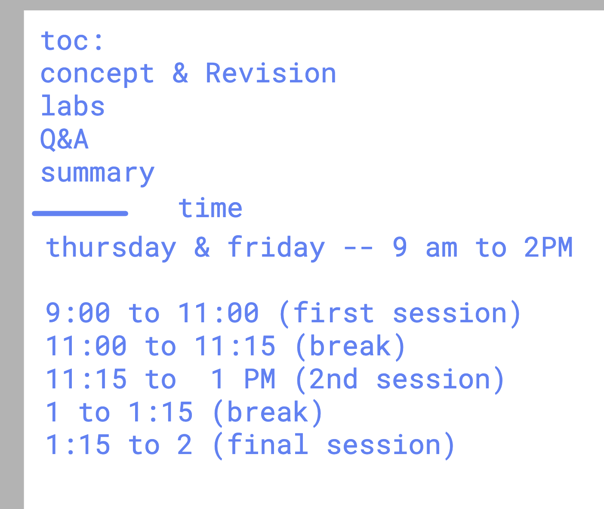

# OpenStack TCS Deployment — 2nd July 2026

## Session Information

---

## Workshop Structure

This workshop covers a 3-day OpenStack deployment using Kolla-Ansible on a 3-node cluster:

- **[Day 1](day1/README.md)** — Prerequisites, network setup, Docker & Ansible installation
- **[Day 2](day2/README.md)** — OpenStack installer validation and configuration
- **[Day 3](day3/README.md)** — Post-installation verification and component checks