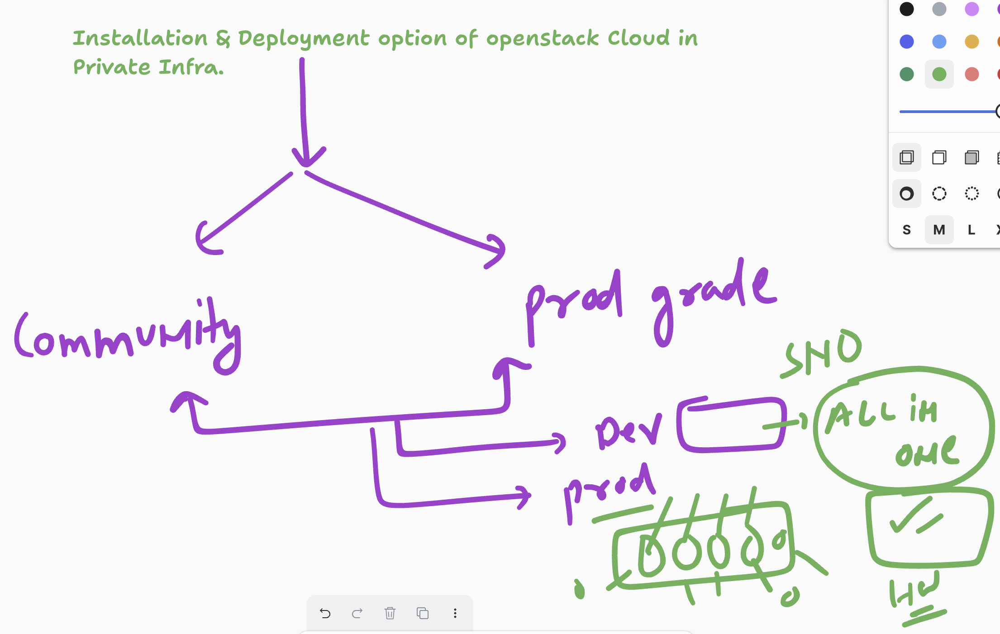
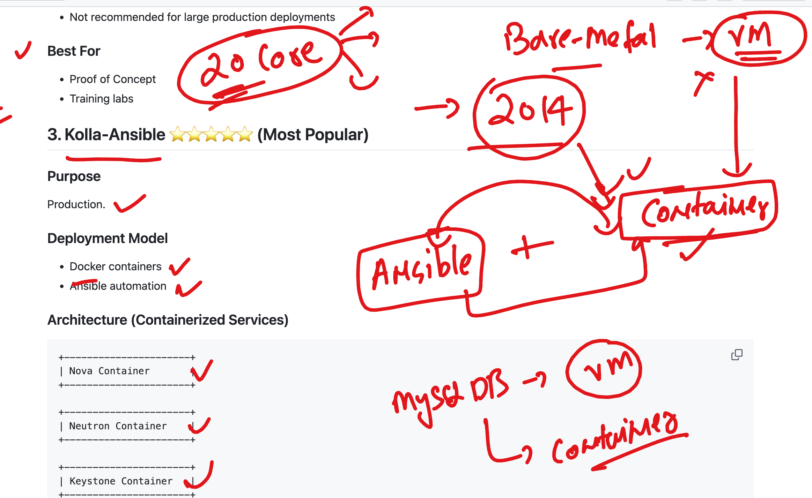

## Openstack  3 layer service architecture 


### Openstack Installer and Deployment options 



## Adopting ansible + container based openstack component deployment



## Checking prerequisite details for all the machines 

## 3 machines 

## check and install few common things 

### login as root user 

```
student@student:~$ sudo -i

root@student:~# whoami
root
root@student:~# 

```
### updating repo of Ubuntu machine 

```
apt  update 
Get:1 http://security.ubuntu.com/ubuntu jammy-security InRelease [129 kB]
Hit:2 http://archive.ubuntu.com/ubuntu jammy InRelease  
Get:3 http://security.ubuntu.com/ubuntu jammy-security/main amd64 Packages [3,351 kB]
Get:4 http://security.ubuntu.com/ubuntu jammy-security/main Translation-en [472 kB]
Get:5 http://security.ubuntu.com/ubuntu jammy-security/main amd64 c-n-f Metadata [14.6 kB]
Get:6 http://security.ubuntu.com/ubuntu jammy-security/restricted amd64 Packages [5,977 kB]
Get:7 http://archive.ubuntu.com/ubuntu jammy-updates InRelease [128 kB]       

```

### Installing tools 

```
apt  install  vim net-tools 
Reading package lists... Done
Building dependency tree... Done
Reading state information... Done

```

### setting hostname permanently 

```
oot@student:~# hostname
student
root@student:~# hostnamectl set-hostname node1
root@student:~# exit
logout
student@student:~$ sudo -i
root@node1:~# hostname
node1
root@node1:~# 

```

### Node1 and Node2 are having 2 NIC 

```
root@node1:~# ifconfig
ens18: flags=4163<UP,BROADCAST,RUNNING,MULTICAST>  mtu 1500
        inet 10.0.19.76  netmask 255.0.0.0  broadcast 10.255.255.255
        inet6 fe80::be24:11ff:fef9:b735  prefixlen 64  scopeid 0x20<link>
        ether bc:24:11:f9:b7:35  txqueuelen 1000  (Ethernet)
        RX packets 35911  bytes 29222088 (29.2 MB)
        RX errors 0  dropped 4182  overruns 0  frame 0
        TX packets 2198  bytes 237056 (237.0 KB)
        TX errors 0  dropped 0 overruns 0  carrier 0  collisions 0

lo: flags=73<UP,LOOPBACK,RUNNING>  mtu 65536
        inet 127.0.0.1  netmask 255.0.0.0
        inet6 ::1  prefixlen 128  scopeid 0x10<host>
        loop  txqueuelen 1000  (Local Loopback)
        RX packets 130  bytes 11713 (11.7 KB)
        RX errors 0  dropped 0  overruns 0  frame 0
        TX packets 130  bytes 11713 (11.7 KB)
        TX errors 0  dropped 0 overruns 0  carrier 0  collisions 0

root@node1:~# ifconfig -a
ens18: flags=4163<UP,BROADCAST,RUNNING,MULTICAST>  mtu 1500
        inet 10.0.19.76  netmask 255.0.0.0  broadcast 10.255.255.255
        inet6 fe80::be24:11ff:fef9:b735  prefixlen 64  scopeid 0x20<link>
        ether bc:24:11:f9:b7:35  txqueuelen 1000  (Ethernet)
        RX packets 36030  bytes 29234095 (29.2 MB)
        RX errors 0  dropped 4211  overruns 0  frame 0
        TX packets 2205  bytes 238926 (238.9 KB)
        TX errors 0  dropped 0 overruns 0  carrier 0  collisions 0

ens19: flags=4098<BROADCAST,MULTICAST>  mtu 1500
        ether bc:24:11:52:1f:3b  txqueuelen 1000  (Ethernet)
        RX packets 0  bytes 0 (0.0 B)
        RX errors 0  dropped 0  overruns 0  frame 0
        TX packets 0  bytes 0 (0.0 B)
        TX errors 0  dropped 0 overruns 0  carrier 0  collisions 0

lo: flags=73<UP,LOOPBACK,RUNNING>  mtu 65536

```

### static IP details for vm1

```
oot@node1:~# cd  /etc/netplan/
root@node1:/etc/netplan# ls
01-netcfg.  01-netcfg.yaml  50-cloud-init.yaml
root@node1:/etc/netplan# cat 01-netcfg.yaml 
network:
  version: 2
  renderer: networkd
  ethernets:
    ens18:
      dhcp4: no
      addresses:
        - 10.0.19.76/8
      routes:
        - to: default
          via: 10.0.0.2
      nameservers:
        addresses:
          - 8.8.8.8
          - 8.8.4.4
root@node1:/etc/netplan# 


===> change this file and test again 

root@node1:/etc/netplan# cat  01-netcfg.yaml 
network:
  version: 2
  renderer: networkd
  ethernets:
    ens19:
      dhcp4: no
      dhcp6: no
    ens18:
      dhcp4: no
      addresses:
        - 10.0.19.76/8
      routes:
        - to: default
          via: 10.0.0.2
      nameservers:
        addresses:
          - 8.8.8.8
          - 8.8.4.4
root@node1:/etc/netplan# netplan  apply 
WARNING:root:Cannot call Open vSwitch: ovsdb-server.service is not running.
```

### iN node1 making hostname based local DNS entry 

```
root@node1:/etc/netplan# nano  /etc/hosts 
root@node1:/etc/netplan# cat /etc/hosts
127.0.0.1 localhost
127.0.1.1 student

# The following lines are desirable for IPv6 capable hosts
::1     ip6-localhost ip6-loopback
fe00::0 ip6-localnet
ff00::0 ip6-mcastprefix
ff02::1 ip6-allnodes
ff02::2 ip6-allrouters

10.0.19.76  node1
10.0.19.77  node2
10.0.19.78  node3
root@node1:/etc/netplan# ping node1
PING node1 (10.0.19.76) 56(84) bytes of data.
64 bytes from node1 (10.0.19.76): icmp_seq=1 ttl=64 time=0.020 ms
^C
--- node1 ping statistics ---
1 packets transmitted, 1 received, 0% packet loss, time 0ms
rtt min/avg/max/mdev = 0.020/0.020/0.020/0.000 ms
root@node1:/etc/netplan# ping node2
PING node2 (10.0.19.77) 56(84) bytes of data.
64 bytes from node2 (10.0.19.77): icmp_seq=1 ttl=64 time=0.435 ms
64 bytes from node2 (10.0.19.77): icmp_seq=2 ttl=64 time=0.449 ms
^C
--- node2 ping statistics ---
2 packets transmitted, 2 received, 0% packet loss, time 1022ms
rtt min/avg/max/mdev = 0.435/0.442/0.449/0.007 ms
root@node1:/etc/netplan# ping node3
PING node3 (10.0.19.78) 56(84) bytes of data.

```

### Install chrony software to match time of all the VM 

```
apt install chrony 
```

## Installing docker ce in all 3 nodes

```

# Add Docker's official GPG key:
sudo apt update
sudo apt install ca-certificates curl
sudo install -m 0755 -d /etc/apt/keyrings
sudo curl -fsSL https://download.docker.com/linux/ubuntu/gpg -o /etc/apt/keyrings/docker.asc
sudo chmod a+r /etc/apt/keyrings/docker.asc

# Add the repository to Apt sources:
sudo tee /etc/apt/sources.list.d/docker.sources <<EOF
Types: deb
URIs: https://download.docker.com/linux/ubuntu
Suites: $(. /etc/os-release && echo "${UBUNTU_CODENAME:-$VERSION_CODENAME}")
Components: stable
Architectures: $(dpkg --print-architecture)
Signed-By: /etc/apt/keyrings/docker.asc
EOF

sudo apt update


sudo apt install docker-ce docker-ce-cli containerd.io docker-buildx-plugin docker-compose-plugin

```

### INstalling python based in Node1 (because node1 is having ansible )

```
apt  install  python3-venv python3-pip python3-docker 
```

### Node1 installing ansible and related details 

```
python3 -m  venv  ~/openstack-setup
root@node1:~# ls
openstack-setup  snap
root@node1:~# 

root@node1:~# source  openstack-setup/bin/activate
(openstack-setup) root@node1:~# 
(openstack-setup) root@node1:~# 
(openstack-setup) root@node1:~# pip install  -U pip setupstools wheel 
Requirement already satisfied: pip in ./openstack-setup/lib/python3.10/site-packages (22.0.2)
Collecting pip
  Downloading pip-26.1.2-py3-none-any.whl (1.8 MB)
     ━━━━━━━━━━━━━━━━━━━━━━━━━━━━━━━━━━━━━━━━ 1.8/1.8 MB 14.4 MB/s eta 0:00:00
ERROR: Could not find a version that satisfies the requirement setupstools (from versions: none)
ERROR: No matching distribution found for setupstools
(openstack-setup) root@node1:~# pip install  -U pip setuptools wheel 
Requirement already satisfied: pip in ./openstack-setup/lib/python3.10/site-packages (22.0.2)
Collecting pip
  Using cached pip-26.1.2-py3-none-any.whl (1.8 MB)
Requirement already satisfied: setuptools in ./openstack-setup/lib/python3.10/site-packages (59.6.0)
Collecting setuptools
  Downloading setuptools-82.0.1-py3-none-any.whl (1.0 MB)
     ━━━━━━━━━━━━━━━━━━━━━━━━━━━━━━━━━━━━━━━━ 1.0/1.0 MB 10.5 MB/s eta 0:00:00
Collecting wheel


===>

pip install  "ansible-core>=2.13,<2.14"
pip install  "kolla-ansible==15.*"
```

