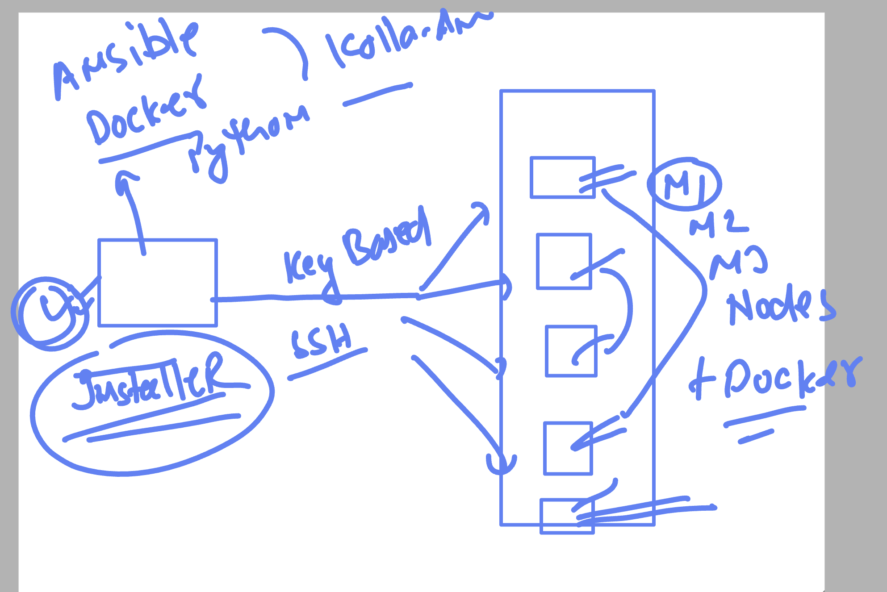

# OpenStack Installer Way



## Validating Installer Machine Details

### 1. Docker Details

```bash
root@node1:~# docker version
Client: Docker Engine - Community
 Version:           29.6.1
 API version:       1.55
 Go version:        go1.26.4
 Git commit:        8900f1d
 Built:             Fri Jun 26 11:40:26 2026
 OS/Arch:           linux/amd64
 Context:           default

Server: Docker Engine - Community
 Engine:
  Version:          29.6.1
  API version:      1.55 (minimum version 1.40)
  Go version:       go1.26.4
  Git commit:       8ec5ab3
  Built:            Fri Jun 26 11:40:26 2026
  OS/Arch:          linux/amd64
  Experimental:     false
 containerd:
  Version:          v2.2.5
  GitCommit:        e53c7c1516c3b2bff98eb76f1f4117477e6f4e66
 runc:
  Version:          1.3.6
  GitCommit:        v1.3.6-0-g491b69ba
 docker-init:
  Version:          0.19.0
  GitCommit:        de40ad0
root@node1:~#
```

### 2. Basic Node Details

```bash
root@node1:~# hostname
node1
root@node1:~# ping node1
PING node1 (10.0.19.76) 56(84) bytes of data.
64 bytes from node1 (10.0.19.76): icmp_seq=1 ttl=64 time=0.040 ms
64 bytes from node1 (10.0.19.76): icmp_seq=2 ttl=64 time=0.045 ms
^C
--- node1 ping statistics ---
2 packets transmitted, 2 received, 0% packet loss, time 1001ms
rtt min/avg/max/mdev = 0.040/0.042/0.045/0.002 ms
root@node1:~# ping node2 -c 2
PING node2 (10.0.19.77) 56(84) bytes of data.
64 bytes from node2 (10.0.19.77): icmp_seq=1 ttl=64 time=1.82 ms
64 bytes from node2 (10.0.19.77): icmp_seq=2 ttl=64 time=0.368 ms

--- node2 ping statistics ---
2 packets transmitted, 2 received, 0% packet loss, time 1002ms
rtt min/avg/max/mdev = 0.368/1.093/1.818/0.725 ms
root@node1:~# ping node3 -c 2
PING node3 (10.0.19.78) 56(84) bytes of data.
64 bytes from node3 (10.0.19.78): icmp_seq=1 ttl=64 time=1.78 ms
64 bytes from node3 (10.0.19.78): icmp_seq=2 ttl=64 time=0.579 ms

--- node3 ping statistics ---
2 packets transmitted, 2 received, 0% packet loss, time 1002ms
rtt min/avg/max/mdev = 0.579/1.181/1.784/0.602 ms
root@node1:~# python3 -V
Python 3.10.12
root@node1:~# ls
openstack-setup  snap
root@node1:~# source openstack-setup/bin/activate
(openstack-setup) root@node1:~# pip list | grep -i ansible
ansible-core       2.13.13
kolla-ansible      15.6.0
(openstack-setup) root@node1:~# pip list | grep -i setup
setuptools         82.0.1
```3

### 2. Check Ansible Inventory

Use this to understand and manage OpenStack services on multi-node setup.

```bash
(openstack-setup) root@node1:~# ls
openstack-setup  snap
(openstack-setup) root@node1:~# ls openstack-setup/
bin  include  lib  lib64  pyvenv.cfg  share
(openstack-setup) root@node1:~# ls openstack-setup/share/
kolla-ansible
(openstack-setup) root@node1:~# ls openstack-setup/share/kolla-ansible/
ansible  doc  etc_examples  init-runonce  init-vpn  requirements.yml  setup.cfg  tools
(openstack-setup) root@node1:~# ls openstack-setup/share/kolla-ansible/ansible/
action_plugins    filter_plugins    kolla-host.yml        module_utils              octavia-certificates.yml  roles
bifrost.yml       gather-facts.yml  library               monasca_cleanup.yml       post-deploy.yml           site.yml
certificates.yml  group_vars        mariadb_backup.yml    nova-libvirt-cleanup.yml  prune-images.yml
destroy.yml       inventory         mariadb_recovery.yml  nova.yml                  rabbitmq-reset-state.yml
(openstack-setup) root@node1:~# ls openstack-setup/share/kolla-ansible/ansible/inventory/
all-in-one  multinode
```

### 3. Create a Separate Directory for Installer Details

```bash
(openstack-setup) root@node1:~# ls openstack-setup/share/kolla-ansible/ansible/inventory/
all-in-one  multinode
(openstack-setup) root@node1:~#
```

### 4. Create Configuration Directory

```bash
(openstack-setup) root@node1:~# mkdir /etc/kolla
(openstack-setup) root@node1:~#
(openstack-setup) root@node1:~# cp -v openstack-setup/share/kolla-ansible/ansible/inventory/multinode /etc/kolla/
'openstack-setup/share/kolla-ansible/ansible/inventory/multinode' -> '/etc/kolla/multinode'

## Node Configuration

### Inventory File Usage

- **node3** configured as storage node
- **node2** configured as compute/Nova node

#### Node2 Resource Verification
### using inventory file 

- node3 as storage node

### Node2 as compute / Nova node 

```
oot@node2:~# free -m
               total        used        free      shared  buff/cache   available
Mem:           15988         270       15190           1         527       15444
Swap:           4095           0        4095
root@node2:~# lscpu 
Architecture:                x86_64
  CPU op-mode(s):            32-bit, 64-bit
  Address sizes:             48 bits physical, 48 bits virtual
  Byte Order:                Little Endian
CPU(s):                      8
  On-line CPU(s) list:       0-7
root@node2:~# 
root@node2:~# 
root@node2:~#
```

## Kolla Configuration

### Copy Configuration F
x86_64
root@node2:~# lscpu  | grep -i vmx
root@node2:~# lscpu  | grep -i svm
Flags:                                   fpu vme de pse tsc msr pae mce cx8 apic sep mtrr pge mca cmov pat pse36 clflush mmx fxsr sse sse2 ht syscall nx mmxext fxsr_opt pdpe1gb rdtscp lm rep_good nopl cpuid extd_apicid tsc_known_freq pni pclmulqdq ssse3 fma cx16 sse4_1 sse4_2 x2apic movbe popcnt tsc_deadline_timer aes xsave avx f16c rdrand hypervisor lahf_lm cmp_legacy svm cr8_legacy abm sse4a misalignsse 3dnowprefetch osvw perfctr_core ssbd ibrs ibpb stibp vmmcall fsgsbase tsc_adjust bmi1 avx2 smep bmi2 rdseed adx smap clflushopt clwb sha_ni xsaveopt xsavec xgetbv1 clzero xsaveerptr wbnoinvd arat npt lbrv nrip_save tsc_scale vmcb_clean flushbyasid pausefilter pfthreshold v_vmsave_vmload vgif umip rdpid overflow_recov succor arch_capabilities
root@node2:~# 

```

### copy globals and password yaml files 

```
openstack-setup) root@node1:~# ls openstack-setup/share/
kolla-ansible
```

## Kolla-Ansible Installer U
(openstack-setup) root@node1:~# ls openstack-setup/share/kolla-ansible/etc_examples/kolla/
globals.yml  passwords.yml
(openstack-setup) root@node1:~# cp -v openstack-setup/share/kolla-ansible/etc_examples/kolla/*  /etc/kolla/
'openstack-setup/share/kolla-ansible/etc_examples/kolla/globals.yml' -> '/etc/kolla/globals.yml'
'openstack-setup/share/kolla-ansible/etc_examples/kolla/passwords.yml' -> '/etc/kolla/passwords.yml'
(openstack-setup) root@node1:~# 

```

## Pre-Deployment Setup

### Install Docker Python Module on Each Node

```bash
apt install python3-docker
```

### Install Ansible Collection in Virtual Environment

```bash
ansible-galaxy collection install ansible.netcommon
==> in Installer node under python virtual environment 
Run Pre-Deployment Checks

```bash
kolla-ansible -i /etc/kolla/multinode prechecks
```

### Deploy OpenStack (After Pre-Checks Pass)

```bash
```
kolla-ansible -i /etc/kolla/multinode prechecks 

===> if all set then do deploy 

kollTroubleshooting Ansible Collection Errors

If you encounter errors related to `sysctl` or include tasks, check installed collections:

```bash
ansible-galaxyrror related to sysctl or include task 

```
ansible-galaxy  collection list 

# /root/.ansible/collections/ansible_collections
Collection        Versi
```

#### Reinstall a Collection (If Needed)

```bash
ansible-galaxy collection install ansible.netcommon:8.5.3 --force
```

### Post-Deployment Steps

**Command executed:**
```
ansible-playbook -e @/etc/kolla/globals.yml -e @/etc/kolla/passwords.yml -e CONFIG_DIR=/etc/kolla /root/openstack-setup/share/kolla-ansible/ansible/post-deploy.yml --inventory /etc/kolla/multinode
```

**Output:**
```
kolla-ansible -i /etc/kolla/multinode

### after deploy -- post deploy 

```
kolla-ansible  -i /etc/kolla/multinode   post-deploy 
Post-Deploying Playbooks : ansible-playbook -e @/etc/kolla/globals.yml  -e @/etc/kolla/passwords.yml -e CONFIG_DIR=/etc/kolla  /root/openstack-setup/share/kolla-ansible/ansible/post-deploy.yml  --inventory /etc/kolla/multinode
[WARNING]: Invalid characters were found in group names but not replaced, use -vvvv to see details

PLAY [Creating clouds.yaml file on the deploy node] *********************************************************************************************************

TASK [Gathering Facts] **************************************************************************************************************************************
ok: [localhost]

TASK [Create /etc/openstack directory] **********************************************************************************************************************
changed: [localhost]

TASK [Template out clouds.yaml] *****************************************************************************************************************************
changed: [localhost]

PLAY [Creating admin openrc file on the deploy node] ********************************************************************************************************

TASK [Gathering Facts] **************************************************************************************************************************************
ok: [localhost]

TASK [Template out admin-openrc.sh] *************************************************************************************************************************
changed: [localhost]

TASK [octavia : Template out octavia-openrc.sh] *************************************************************************************************************
skipping: [localhost]

PLAY RECAP **************************************************************************************************************************************************
localhost                  : ok=5    changed=3    unreachable=0    failed=0    skipped=1    rescued=0    ignored=0   

```