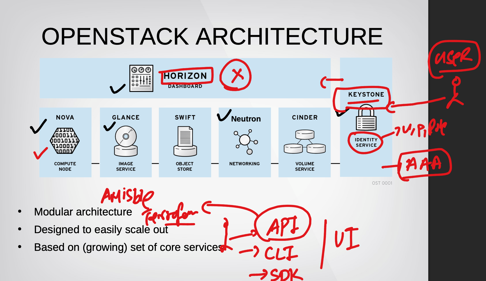
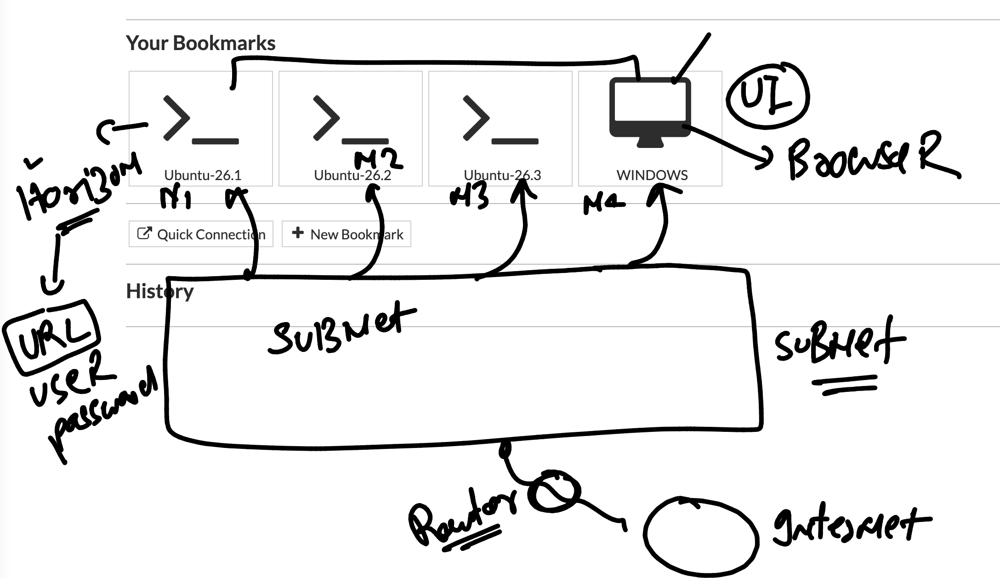
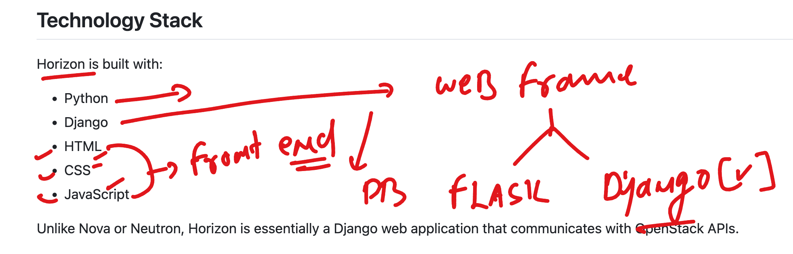
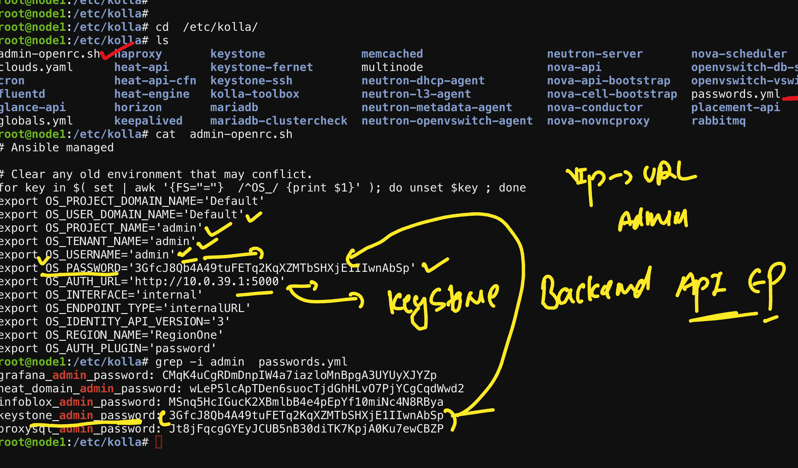
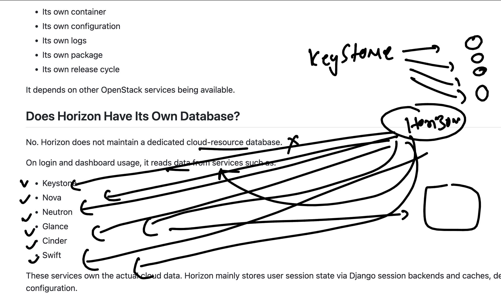
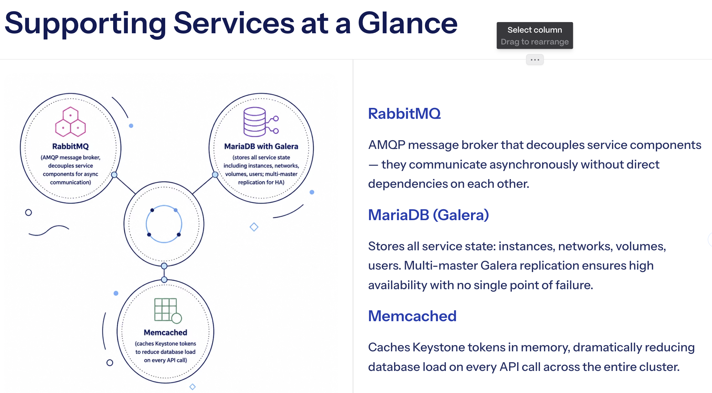

# OpenStack Day 3 — Post-Installation Verification

## OpenStack Architecture Revision

> **Note:** Horizon is an optional service.



---

## Post-Installation Verification

### Navigate to Kolla config directory

```bash
cd /etc/kolla/
ls
```

**Output:**

```
admin-openrc.sh  haproxy       keystone              memcached                  neutron-server       nova-scheduler
clouds.yaml      heat-api      keystone-fernet       multinode                  nova-api             openvswitch-db-server
cron             heat-api-cfn  keystone-ssh          neutron-dhcp-agent         nova-api-bootstrap   openvswitch-vswitchd
fluentd          heat-engine   kolla-toolbox         neutron-l3-agent           nova-cell-bootstrap  passwords.yml
glance-api       horizon       mariadb               neutron-metadata-agent     nova-conductor       placement-api
globals.yml      keepalived    mariadb-clustercheck  neutron-openvswitch-agent  nova-novncproxy      rabbitmq
```

### Review configuration files

```bash
vim globals.yml
vim multinode
```

---

### Check Docker version

```bash
docker version
```

**Output:**

```
Client: Docker Engine - Community
 Version:           29.6.1
 API version:       1.55
 Go version:        go1.26.4
 Git commit:        8900f1d
 Built:             Fri Jun 26 11:40:26 2026
 OS/Arch:           linux/amd64
 Context:           default

Server: Docker Engine - Community
 Engine:
  Version:          29.6.1
  API version:      1.55 (minimum version 1.40)
  Go version:       go1.26.4
  Git commit:       8ec5ab3
  Built:            Fri Jun 26 11:40:26 2026
  OS/Arch:          linux/amd64
  Experimental:     false
 containerd:
  Version:          v2.2.5
  GitCommit:        e53c7c1516c3b2bff98eb76f1f4117477e6f4e66
 runc:
  Version:          1.3.6
  GitCommit:        v1.3.6-0-g491b69ba
 docker-init:
  Version:          0.19.0
  GitCommit:        de40ad0
```

---

### List Kolla Docker images

```bash
docker images
```

**Output:**

| IMAGE | ID | DISK USAGE | CONTENT SIZE |
|---|---|---|---|
| quay.io/openstack.kolla/cron:zed-rocky-9 | 18fcfd53bcae | 843MB | 199MB |
| quay.io/openstack.kolla/fluentd:zed-rocky-9 | c97ce65a07ab | 1.21GB | 288MB |
| quay.io/openstack.kolla/glance-api:zed-rocky-9 | b7da50e0c06c | 1.9GB | 433MB |
| quay.io/openstack.kolla/haproxy:zed-rocky-9 | 859ec6876581 | 862MB | 203MB |
| quay.io/openstack.kolla/heat-api-cfn:zed-rocky-9 | 1841dc67ebe5 | 1.76GB | 401MB |
| quay.io/openstack.kolla/heat-api:zed-rocky-9 | e828f12e2f09 | 1.76GB | 401MB |
| quay.io/openstack.kolla/heat-engine:zed-rocky-9 | 83ef4e88acfb | 1.76GB | 401MB |
| quay.io/openstack.kolla/horizon:zed-rocky-9 | 43e1316827b6 | 2.07GB | 446MB |
| quay.io/openstack.kolla/keepalived:zed-rocky-9 | d5f60051ab0b | 894MB | 210MB |
| quay.io/openstack.kolla/keystone-fernet:zed-rocky-9 | fa479879bc7e | 1.79GB | 412MB |
| quay.io/openstack.kolla/keystone-ssh:zed-rocky-9 | b293cfcb2139 | 1.79GB | 412MB |
| quay.io/openstack.kolla/keystone:zed-rocky-9 | a7f3481ece28 | 1.79GB | 411MB |
| quay.io/openstack.kolla/kolla-toolbox:zed-rocky-9 | 243104482ce6 | 1.58GB | 391MB |
| quay.io/openstack.kolla/mariadb-clustercheck:zed-rocky-9 | e9efb50180c0 | 989MB | 230MB |
| quay.io/openstack.kolla/mariadb-server:zed-rocky-9 | 2bfcf1ef33c5 | 1.35GB | 287MB |
| quay.io/openstack.kolla/memcached:zed-rocky-9 | edfa95abbcd7 | 883MB | 207MB |
| quay.io/openstack.kolla/neutron-dhcp-agent:zed-rocky-9 | a85781189b8d | 2.01GB | 456MB |
| quay.io/openstack.kolla/neutron-l3-agent:zed-rocky-9 | 426aa47469a4 | 2.06GB | 468MB |
| quay.io/openstack.kolla/neutron-metadata-agent:zed-rocky-9 | 1b8179a0ed0a | 2.01GB | 456MB |
| quay.io/openstack.kolla/neutron-openvswitch-agent:zed-rocky-9 | 6ccba9c49b30 | 2.01GB | 456MB |
| quay.io/openstack.kolla/neutron-server:zed-rocky-9 | d8cb1a508e04 | 2.02GB | 458MB |
| quay.io/openstack.kolla/nova-api:zed-rocky-9 | ae6c90a545eb | 2.07GB | 471MB |
| quay.io/openstack.kolla/nova-conductor:zed-rocky-9 | ... | ... | ... |

---

## OpenStack Components Running on node1

### Filter by service

```bash
# Horizon
docker ps | grep -i hori

# Keystone
docker ps | grep -i keystone

# Glance
docker ps | grep -i glance
```

**Output:**

```
51eec1f9053a   quay.io/openstack.kolla/horizon:zed-rocky-9             "dumb-init --single-…"   2 days ago   Up 4 hours (healthy)   horizon
4b3becf5f51e   quay.io/openstack.kolla/keystone:zed-rocky-9            "dumb-init --single-…"   2 days ago   Up 4 hours (healthy)   keystone
39cf8ab46217   quay.io/openstack.kolla/keystone-fernet:zed-rocky-9     "dumb-init --single-…"   2 days ago   Up 4 hours (healthy)   keystone_fernet
348484f2c975   quay.io/openstack.kolla/keystone-ssh:zed-rocky-9        "dumb-init --single-…"   2 days ago   Up 4 hours (healthy)   keystone_ssh
add760030436   quay.io/openstack.kolla/glance-api:zed-rocky-9          "dumb-init --single-…"   2 days ago   Up 4 hours (healthy)   glance_api
```

### Full container list

```bash
docker ps
```

**Output:**

| CONTAINER ID | IMAGE | CREATED | STATUS | NAME |
|---|---|---|---|---|
| 51eec1f9053a | quay.io/openstack.kolla/horizon:zed-rocky-9 | 2 days ago | Up 4 hours (healthy) | horizon |
| 3c57c242c367 | quay.io/openstack.kolla/heat-engine:zed-rocky-9 | 2 days ago | Up 4 hours (healthy) | heat_engine |
| 9edd84e4cf61 | quay.io/openstack.kolla/heat-api-cfn:zed-rocky-9 | 2 days ago | Up 4 hours (healthy) | heat_api_cfn |
| bbd78539a7b1 | quay.io/openstack.kolla/heat-api:zed-rocky-9 | 2 days ago | Up 4 hours (healthy) | heat_api |


### Understanding Openstack deployment lab infra & Network 

```
oot@node1:/etc/kolla# grep -i vip  /etc/kolla/globals.yml 
kolla_internal_vip_address: "10.0.39.1"
# This should be a VIP, an unused IP on your network that will float betw

```



### Important info about Horizon service 



### Understanding info about default user,password and EP 



### Updating info about connections 



### Understanding the backend supported services for openstack 

