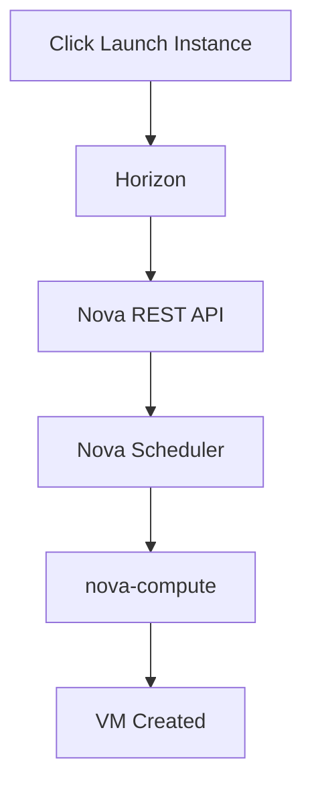
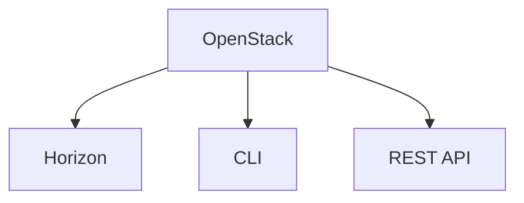
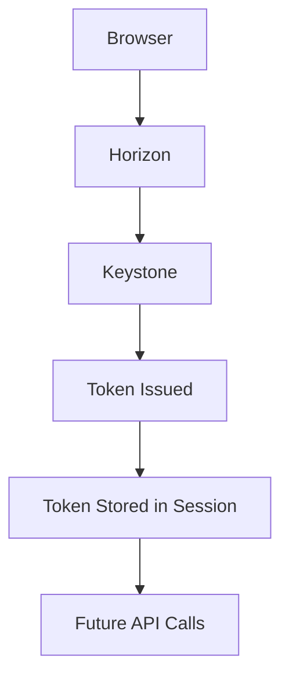
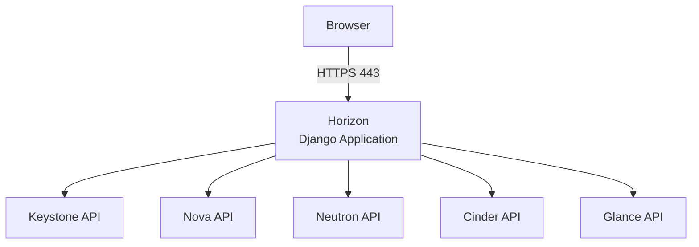

# Chapter 1: What Is Horizon?

Horizon is the official web-based graphical dashboard (GUI) for OpenStack.

It is the management portal that allows users and administrators to interact with OpenStack services through a browser instead of using CLI commands or direct REST API calls. Horizon itself does not create VMs, networks, or volumes; it calls APIs exposed by other OpenStack services.

Horizon is simply the UI layer.

## Horizon in Context

| Cloud Platform | Web Portal |
|---|---|
| AWS | AWS Management Console |
| Azure | Azure Portal |
| GCP | Google Cloud Console |
| OpenStack | Horizon Dashboard |

## Common Misconception

Many beginners think:

> "Horizon creates virtual machines."

This is incorrect. Horizon does not create resources directly. It only sends API requests.

Example flow when launching an instance:

Horizon is a client layer.

## Three Ways to Manage OpenStack

Every OpenStack cloud can be managed in three ways:

All three ultimately invoke the same OpenStack service APIs.

For VM creation, these are equivalent:

1. Browser -> Horizon -> Nova API
2. `openstack server create` -> Nova API
3. `POST /servers` -> Nova API

Regardless of interface, backend behavior is the same.

## Why Horizon Was Developed

Before Horizon, administrators primarily used:

- REST APIs
- Python scripts
- Command-line interface

These worked well for automation, but were less convenient for:

- Cloud administrators
- Help desk teams
- Developers
- End users

Horizon provides an easier web experience while still using the same APIs underneath.

## Is Horizon Mandatory?

No. OpenStack works without Horizon.

Many enterprises do not install it because they rely on:

- Terraform
- Ansible
- Heat
- Custom portals
- ServiceNow
- Jenkins
- Kubernetes integrations

These tools interact directly with APIs.

## Technology Stack

Horizon is built with:

- Python
- Django
- HTML
- CSS
- JavaScript

Unlike Nova or Neutron, Horizon is essentially a Django web application that communicates with OpenStack APIs.

## Is Horizon a Microservice?

Yes. Horizon is an independent OpenStack service with:

- Its own container
- Its own configuration
- Its own logs
- Its own package
- Its own release cycle

It depends on other OpenStack services being available.

## Does Horizon Have Its Own Database?

No. Horizon does not maintain a dedicated cloud-resource database.

On login and dashboard usage, it reads data from services such as:

- Keystone
- Nova
- Neutron
- Glance
- Cinder
- Swift

These services own the actual cloud data. Horizon mainly stores user session state via Django session backends and caches, depending on configuration.

## What Horizon Actually Does

Horizon provides graphical pages for managing OpenStack services, including:

- Identity: users, projects, roles, domains
- Compute: instances, flavors, key pairs, availability zones
- Networking: networks, routers, floating IPs, security groups, subnets
- Storage: volumes, snapshots, backups
- Images: upload, delete, modify
- Administration: hypervisors, services, quotas, usage reports

## Who Uses Horizon?

Two typical personas:

- Administrator
- Project user

Administrator can manage:

- Projects
- Users
- Compute hosts
- Services
- Hypervisors
- Quotas
- Images

Project user can manage only project-scoped resources, for example:

- Launch VMs
- Create networks
- Create volumes
- Upload images (if permitted)

Permissions are enforced by Keystone roles.

## Horizon Authentication

Common interview question:

> "Does Horizon authenticate users by itself?"

No. Authentication is handled by Keystone.

If Keystone is unavailable, Horizon cannot log users in.

## Is Horizon Tightly Coupled?

No. Horizon is designed to be extensible.

It supports plugins for:

- Heat
- Magnum
- Octavia
- Ironic
- Trove
- Sahara
- Third-party vendor dashboards

Plugin architecture is a core design principle.

## High-Level Architecture

Horizon does not communicate directly with KVM, libvirt, RabbitMQ, or MariaDB. It communicates with public or internal OpenStack REST APIs.

## Characteristics of Horizon

| Feature | Description |
|---|---|
| Service type | Dashboard (GUI) |
| Programming language | Python (Django) |
| Communication | REST APIs |
| Authentication | Keystone |
| Default protocol | HTTPS |
| Default port | 80/443 behind Apache, NGINX, or HAProxy (deployment-dependent) |
| Container in Kolla | `horizon` |
| Database | No dedicated cloud resource database |
| CLI equivalent | `openstack` CLI |
| API equivalent | OpenStack REST APIs |

