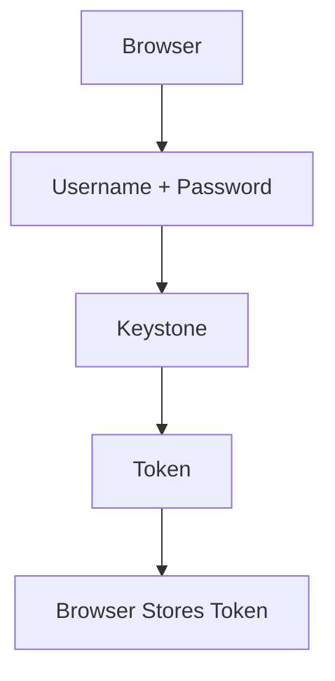
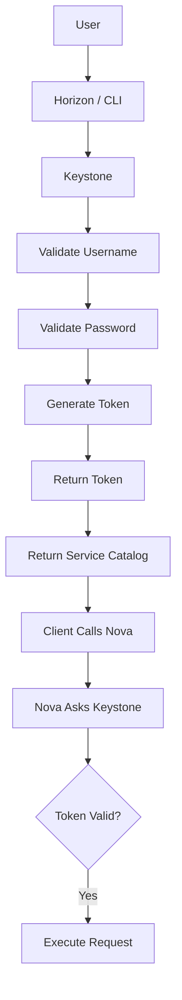
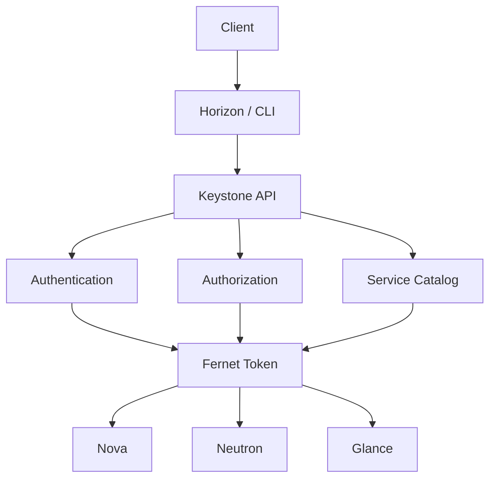

# Keystone in OpenStack

Keystone is the Identity and Access Management (IAM) service of OpenStack. It provides authentication, authorization, token management, and service discovery for all OpenStack services.

## 1. Why OpenStack Needs Keystone

Imagine OpenStack without Keystone. You have services like:

- Nova
- Neutron
- Glance
- Cinder
- Swift
- Horizon

Now suppose a user sends:

```http
POST /servers
```

Without Keystone, Nova cannot reliably know:

- Who the user is
- Whether the user is allowed to create a VM
- Which project the user belongs to
- Where Glance is located
- Where Neutron is located

Without a centralized identity service, each service would need to maintain its own users, passwords, and roles:

```text
Nova
 ├── users
 ├── passwords
 └── roles

Neutron
 ├── users
 ├── passwords
 └── roles

Glance
 ├── users
 ├── passwords
 └── roles
```

This is a maintenance nightmare. Keystone solves it by becoming the single source of identity.

## 2. Keystone Responsibilities

Keystone has four major responsibilities:

- Authentication
- Authorization
- Token management
- Service catalog

## 3. Authentication (AuthN)

Authentication answers: **Who are you?**

Example credentials:

- Username: `admin`
- Password: `OpenStack@123`

Keystone checks:

- Does the user exist?
- Is the password correct?

If yes, authentication succeeds. If not, authentication fails.

## 4. Authorization (AuthZ)

After authentication, the next question is: **What are you allowed to do?**

Example user: `developer`

Can:

- Create VM
- Delete own VM

Cannot:

- Delete projects
- Create users

Keystone determines permissions using role assignments.

- Authentication proves identity.
- Authorization determines permissions.

## 5. Token Management

After successful login, Keystone does not require your password on every request. It issues a token.



Subsequent requests include the token:

```http
GET /servers
X-Auth-Token: gAAAAABm.....
```

Nova trusts the token instead of asking for credentials again.

Modern OpenStack uses Fernet tokens by default.

## 6. Service Catalog

How do clients know where each OpenStack API is located?

Keystone maintains a **service catalog**.

Example entries:

- Nova: `http://controller:8774`
- Neutron: `http://controller:9696`
- Glance: `http://controller:9292`

On successful authentication, Keystone returns:

- Token
- Service catalog

So clients can discover all service endpoints dynamically.

## 7. Keystone Entities

Keystone manages identity objects such as:

- Domain
- Project
- User
- Role
- Group
- Application credentials

These are identity resources, not compute/network/storage resources.

## 8. Domain

A domain is the highest administrative boundary.

Example hierarchy:

```text
Company
├── Engineering Domain
├── HR Domain
└── Finance Domain
```

Each domain can contain:

- Users
- Projects
- Groups

Large organizations often use multiple domains.

## 9. Project

A project (older term: tenant) is a resource container.

Example resources inside a project:

- VMs
- Networks
- Volumes
- Images
- Floating IPs

Resources belong to projects, and projects have quotas.

## 10. User

A user can represent:

- Human
- Service
- Application

Examples:

- `admin`
- `developer`
- `demo`
- `nova`
- `glance`
- `neutron`

OpenStack services also authenticate with Keystone via service users (for example, `nova`).

## 11. Role

A role defines permissions: **what actions can be performed**.

Examples:

- `admin`
- `member`
- `reader`

Users gain permissions through role assignments.

## 12. Group

Groups simplify bulk role assignment.

Instead of assigning a role to hundreds of users individually, assign the role to a group.

```text
Developers Group
       -> 100 Users
       -> member Role
```

## 13. Endpoint

Each OpenStack service registers endpoints (for example: public, internal, admin).

Example for Nova:

| Interface | URL |
|---|---|
| Public | `https://cloud.example.com:8774` |
| Internal | `http://10.0.0.10:8774` |
| Admin | `http://10.0.0.10:8774` |

Clients discover these via Keystone service catalog.

## 14. Authentication Flow

Core flow every OpenStack engineer should know:



Important:

- Password is used only during login.
- Subsequent requests use token-based auth.

## 15. What Keystone Does NOT Do

Keystone does **not**:

- Create VMs
- Create networks
- Create volumes
- Schedule compute
- Store images

Keystone **does** manage:

- Identity
- Access
- Tokens
- Endpoints
- Service catalog

## 16. Keystone Architecture



Every OpenStack service trusts Keystone as the identity authority.

## 17. Real-World Analogy

Think of an airport:

- Keystone = Immigration and security
- Token = Boarding pass
- Nova = Flight
- Neutron = Airport network
- Cinder = Baggage

Flow:

1. You show passport (username/password).
2. Security verifies identity (authentication).
3. You receive boarding pass (token).
Every airport gate accepts the boarding pass
Nobody asks for your passport again

That is exactly how Keystone works.