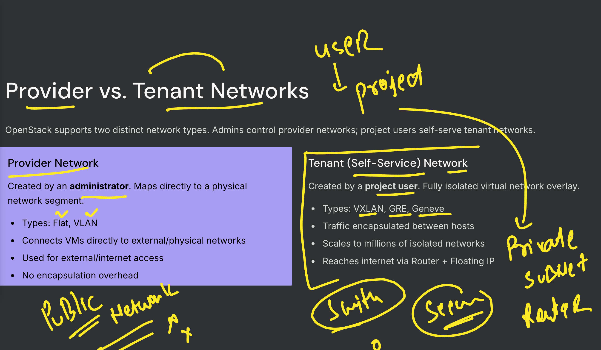
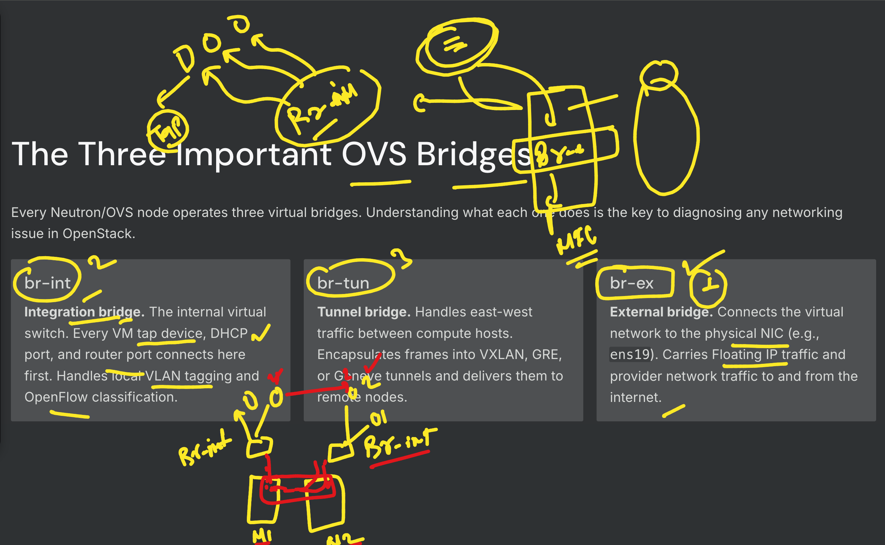
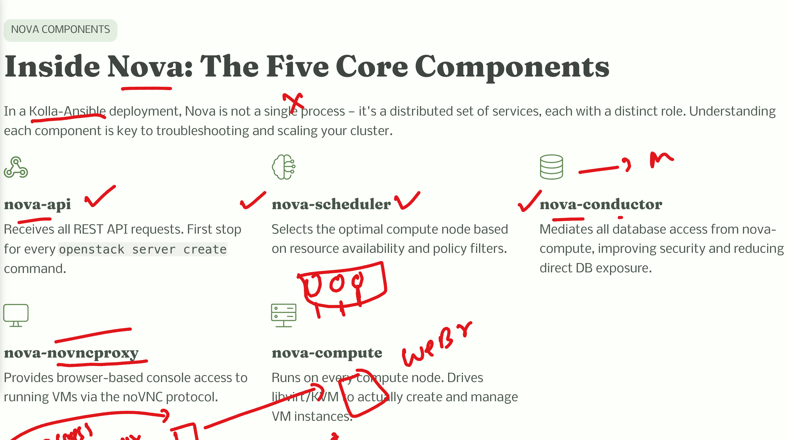
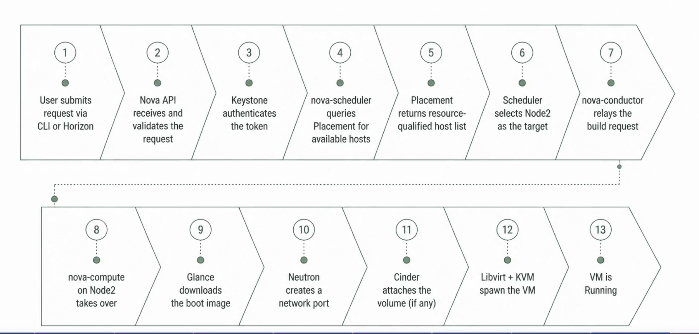
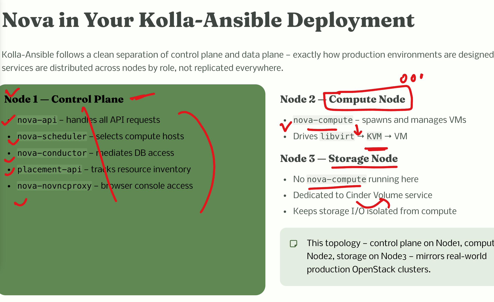

## Revision 

### kolla-ansible is pulling container images from Quay.io Registry 


### verify openstack service 

```
root@node1:~# ls /etc/kolla/
admin-openrc.sh   glance-api    horizon          kolla-toolbox         neutron-l3-agent           nova-cell-bootstrap    passwords.yml
cinder-api        globals.yml   jack-user.sh     mariadb               neutron-metadata-agent     nova-conductor         placement-api
cinder-scheduler  haproxy       keepalived       mariadb-clustercheck  neutron-openvswitch-agent  nova-novncproxy        rabbitmq
clouds.yaml       heat-api      keystone         memcached             neutron-server             nova-scheduler
cron              heat-api-cfn  keystone-fernet  multinode             nova-api                   openvswitch-db-server
fluentd           heat-engine   keystone-ssh     neutron-dhcp-agent    nova-api-bootstrap         openvswitch-vswitchd
root@node1:~# source  /etc/kolla/admin-openrc.sh 
root@node1:~# 
root@node1:~# openstack service list
+----------------------------------+-----------+----------------+
| ID                               | Name      | Type           |
+----------------------------------+-----------+----------------+
| 08b4431534be4f8587b13e8ac4c4a07d | placement | placement      |
| 4eef5e18b5b04baa8b46ff0709f4d048 | heat      | orchestration  |
| 885bb275217c4a5f83854f108b9fa820 | glance    | image          |
| 8b6d6e5ebb474ccc8bea2d8737512cdb | keystone  | identity       |
| 9fbbfe8249444183b8020ea6aa3a1249 | neutron   | network        |
| b231a7cfd2a9480d835abd1116672988 | nova      | compute        |
| ba0aa15283934cd6a1018938c148e24f | heat-cfn  | cloudformation |
| c810968d45b44fa7a8c65fc9cc591ec6 | cinderv3  | volumev3       |
+----------------------------------+-----------+----------------+
root@node1:~# openstack catalog  list
+-----------+----------------+-----------------------------------------------------------------------+
| Name      | Type           | Endpoints                                                             |
+-----------+----------------+-----------------------------------------------------------------------+
| placement | placement      | RegionOne                                                             |
|           |                |   internal: http://10.0.39.1:8780                                     |
|           |                | RegionOne                                                             |
|           |                |   public: http://10.0.39.1:8780                                       |
|           |                |                                                     

```

## openstack neutron provider vs tenant network areas



### openstack neutron bridge tech 



## Introduction to Nova components



### Nova vm creating workflow 



### Nova in Our setup 

