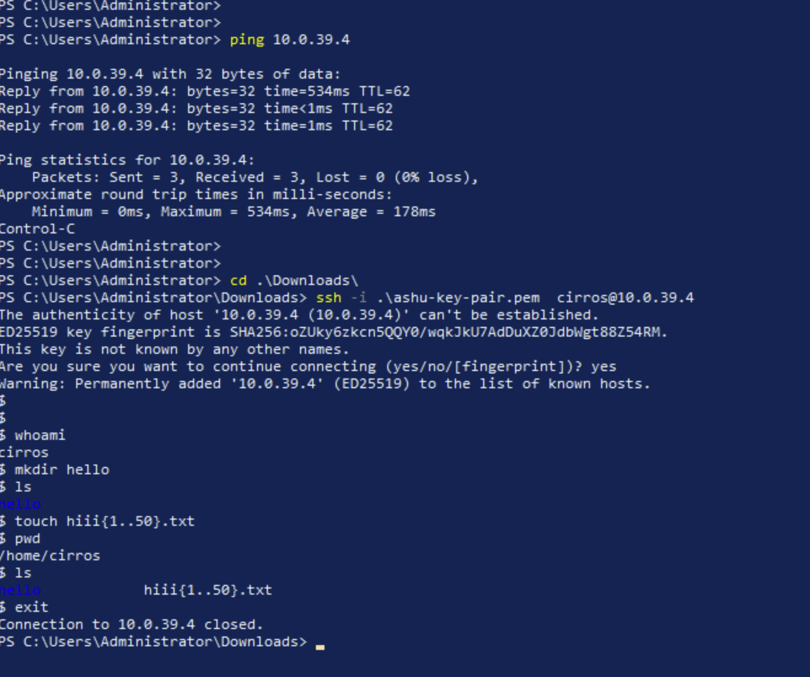

## Revision 

### kolla-ansible is pulling container images from Quay.io Registry 


### verify openstack service 

```
root@node1:~# ls /etc/kolla/
admin-openrc.sh   glance-api    horizon          kolla-toolbox         neutron-l3-agent           nova-cell-bootstrap    passwords.yml
cinder-api        globals.yml   jack-user.sh     mariadb               neutron-metadata-agent     nova-conductor         placement-api
cinder-scheduler  haproxy       keepalived       mariadb-clustercheck  neutron-openvswitch-agent  nova-novncproxy        rabbitmq
clouds.yaml       heat-api      keystone         memcached             neutron-server             nova-scheduler
cron              heat-api-cfn  keystone-fernet  multinode             nova-api                   openvswitch-db-server
fluentd           heat-engine   keystone-ssh     neutron-dhcp-agent    nova-api-bootstrap         openvswitch-vswitchd
root@node1:~# source  /etc/kolla/admin-openrc.sh 
root@node1:~# 
root@node1:~# openstack service list
+----------------------------------+-----------+----------------+
| ID                               | Name      | Type           |
+----------------------------------+-----------+----------------+
| 08b4431534be4f8587b13e8ac4c4a07d | placement | placement      |
| 4eef5e18b5b04baa8b46ff0709f4d048 | heat      | orchestration  |
| 885bb275217c4a5f83854f108b9fa820 | glance    | image          |
| 8b6d6e5ebb474ccc8bea2d8737512cdb | keystone  | identity       |
| 9fbbfe8249444183b8020ea6aa3a1249 | neutron   | network        |
| b231a7cfd2a9480d835abd1116672988 | nova      | compute        |
| ba0aa15283934cd6a1018938c148e24f | heat-cfn  | cloudformation |
| c810968d45b44fa7a8c65fc9cc591ec6 | cinderv3  | volumev3       |
+----------------------------------+-----------+----------------+
root@node1:~# openstack catalog  list
+-----------+----------------+-----------------------------------------------------------------------+
| Name      | Type           | Endpoints                                                             |
+-----------+----------------+-----------------------------------------------------------------------+
| placement | placement      | RegionOne                                                             |
|           |                |   internal: http://10.0.39.1:8780                                     |
|           |                | RegionOne                                                             |
|           |                |   public: http://10.0.39.1:8780                                       |
|           |                |                                                     

```

## openstack neutron provider vs tenant network areas


### openstack neutron bridge tech 


## Introduction to Nova components


### Nova vm creating workflow 


### Nova in Our setup 


### validation 

```
ot@node1:~# docker  ps  | grep -i nova
04fe7166e196   quay.io/openstack.kolla/nova-novncproxy:zed-rocky-9             "dumb-init --single-…"   4 days ago     Up 6 hours (healthy)             nova_novncproxy
ce61c4266fc9   quay.io/openstack.kolla/nova-conductor:zed-rocky-9              "dumb-init --single-…"   4 days ago     Up 6 hours (healthy)             nova_conductor
f5aa3cf37e03   quay.io/openstack.kolla/nova-api:zed-rocky-9                    "dumb-init --single-…"   4 days ago     Up 6 hours (healthy)             nova_api
5849492a5734   quay.io/openstack.kolla/nova-scheduler:zed-rocky-9              "dumb-init --single-…"   4 days ago     Up 6 hours (healthy)             nova_scheduler
root@node1:~# 
root@node1:~# 
root@node1:~# ssh node2  docker  ps  | grep -i nova
f9eb129495a8   quay.io/openstack.kolla/nova-compute:zed-rocky-9                "dumb-init --single-…"   17 hours ago   Up 6 hours (healthy)                      nova_compute
a216fb3359d7   quay.io/openstack.kolla/nova-libvirt:zed-rocky-9                "dumb-init --single-…"   4 days ago     Up 6 hours (healthy)                      nova_libvirt
3bde37421faf   quay.io/openstack.kolla/nova-ssh:zed-rocky-9                    "dumb-init --single-…"   4 days ago     Up 6 hours (healthy)                      nova_ssh
root@node1:~# 
root@node1:~# ssh node3  docker  ps  | grep -i nova
root@node1:~# 
root@node1:~# source /etc/kolla/admin-openrc.sh 
root@node1:~# 
r
root@node1:~# openstack service list 
+----------------------------------+-----------+----------------+
| ID                               | Name      | Type           |
+----------------------------------+-----------+----------------+
| 08b4431534be4f8587b13e8ac4c4a07d | placement | placement      |
| 4eef5e18b5b04baa8b46ff0709f4d048 | heat      | orchestration  |
| 885bb275217c4a5f83854f108b9fa820 | glance    | image          |
| 8b6d6e5ebb474ccc8bea2d8737512cdb | keystone  | identity       |
| 9fbbfe8249444183b8020ea6aa3a1249 | neutron   | network        |
| b231a7cfd2a9480d835abd1116672988 | nova      | compute        |
| ba0aa15283934cd6a1018938c148e24f | heat-cfn  | cloudformation |
| c810968d45b44fa7a8c65fc9cc591ec6 | cinderv3  | volumev3       |
+----------------------------------+-----------+----------------+

```

### More nova related commands 

```
ot@node1:~# openstack compute  service list 
+--------------------------------------+----------------+-------+----------+---------+-------+----------------------------+
| ID                                   | Binary         | Host  | Zone     | Status  | State | Updated At                 |
+--------------------------------------+----------------+-------+----------+---------+-------+----------------------------+
| d6d42953-70de-44fb-942c-29e93a4147b1 | nova-scheduler | node1 | internal | enabled | up    | 2026-07-08T06:47:16.000000 |
| 5308fd21-5706-4551-85c5-9fbe178d4990 | nova-conductor | node1 | internal | enabled | up    | 2026-07-08T06:47:21.000000 |
| c2646ab6-08b1-4a6f-8761-c98f5b4b3c3b | nova-compute   | node2 | nova     | enabled | up    | 2026-07-08T06:47:22.000000 |
+--------------------------------------+----------------+-------+----------+---------+-------+----------------------------+
root@node1:~# 
root@node1:~# openstack hypervisor 
openstack: 'hypervisor' is not an openstack command. See 'openstack --help'.
Did you mean one of these?
  hypervisor list
  hypervisor show
  hypervisor stats show
  extension list
  extension show
root@node1:~# openstack hypervisor list
+----+---------------------+-----------------+------------+-------+
| ID | Hypervisor Hostname | Hypervisor Type | Host IP    | State |
+----+---------------------+-----------------+------------+-------+
|  1 | node2               | QEMU            | 10.0.19.77 | up    |
+----+---------------------+-----------------+------------+-------+
root@node1:~# cat /etc/hosts
127.0.0.1 localhost
127.0.1.1 student

# The following lines are desirable for IPv6 capable hosts
::1     ip6-localhost ip6-loopback
fe00::0 ip6-localnet
ff00::0 ip6-mcastprefix
ff02::1 ip6-allnodes
ff02::2 ip6-allrouters

10.0.19.76  node1
10.0.19.77  node2
10.0.19.78  node3
root@node1:~# openstack hypervisor show node2

```

### login to linux vm with sshkey pair (private key)



