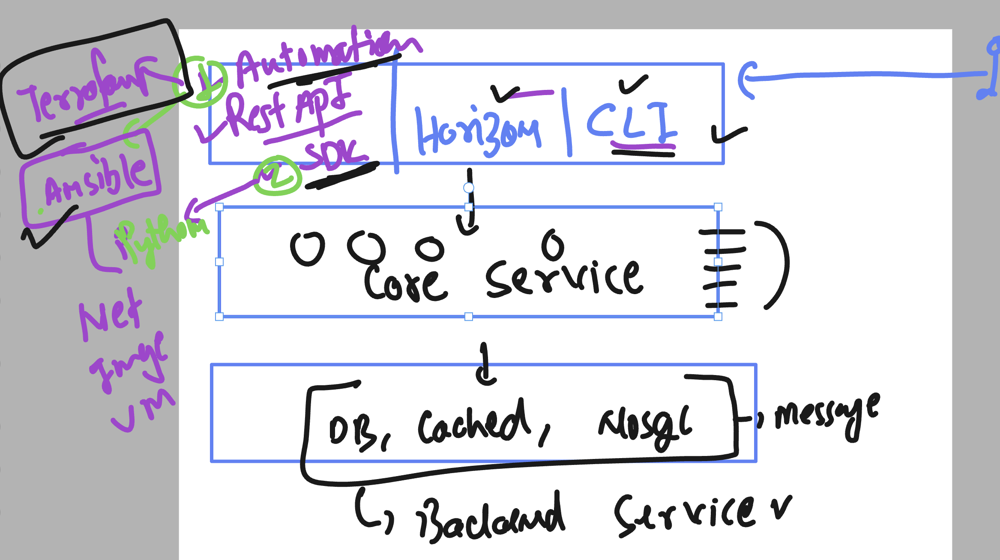

## Revision process



### Understanding the logs location for openstack services

```
openstack-setup) root@node1:/etc/kolla# cd  /var/log/
(openstack-setup) root@node1:/var/log# ls
alternatives.log       auth.log.1     chrony                 dmesg.0     dpkg.log       journal        landscape  syslog.2.gz
alternatives.log.1     auth.log.2.gz  cloud-init.log         dmesg.1.gz  dpkg.log.1     kern.log       lastlog    ubuntu-advantage.log
alternatives.log.2.gz  bootstrap.log  cloud-init-output.log  dmesg.2.gz  dpkg.log.2.gz  kern.log.1     private    unattended-upgrades
apt                    btmp           dist-upgrade           dmesg.3.gz  faillog        kern.log.2.gz  syslog     wtmp
auth.log               btmp.1         dmesg                  dmesg.4.gz  installer      kolla          syslog.1
(openstack-setup) root@node1:/var/log# cd kolla
(openstack-setup) root@node1:/var/log/kolla# ls
ansible.log  cinder  fluentd  glance  haproxy  heat  horizon  keystone  mariadb  neutron  nova  openvswitch  placement  rabbitmq
(openstack-setup) root@node1:/var/log/kolla# 
(openstack-setup) root@node1:/var/log/kolla# 
(openstack-setup) root@node1:/var/log/kolla# ls  glance/
glance-api.log
(openstack-setup) root@node1:/var/log/kolla# ls  neutron/
dnsmasq.log             neutron-l3-agent.log        neutron-openvswitch-agent.log  privsep-helper.log
neutron-dhcp-agent.log  neutron-metadata-agent.log  neutron-server.log
(openstack-setup) root@node1:/var/log/kolla# ls  nova/
apache-access.log  nova-api-access.log  nova-api.log        nova-manage.log           nova-metadata-error.log  nova-scheduler.log
apache-error.log   nova-api-error.log   nova-conductor.log  nova-metadata-access.log  nova-novncproxy.log
(openstack-setup) root@node1:/var/log/kolla# 

```

## the mindset of troubleshooting VM related issues 


### Introduction to storage service in openstack 


### cinder setup process

```
lsblk 
NAME                                            MAJ:MIN RM   SIZE RO TYPE MOUNTPOINTS
loop0                                             7:0    0  63.9M  1 loop /snap/core20/2318
loop1                                             7:1    0  63.8M  1 loop /snap/core20/2866
loop2                                             7:2    0  91.7M  1 loop /snap/lxd/38800
loop3                                             7:3    0 115.1M  1 loop /snap/lxd/40115
loop4                                             7:4    0  38.8M  1 loop /snap/snapd/21759
loop5                                             7:5    0    74M  1 loop /snap/core22/2411
loop6                                             7:6    0  50.1M  1 loop /snap/snapd/27406
sda                                               8:0    0   100G  0 disk 
├─sda1                                            8:1    0     1M  0 part 
├─sda2                                            8:2    0     2G  0 part /boot
└─sda3                                            8:3    0    98G  0 part 
  └─ubuntu--vg-ubuntu--lv                       253:2    0    49G  0 lvm  /
sdb                                               8:16   0   100G  0 disk 

```
### installing on node3

```
sudo apt install lvm2  thin-provisioning-tools  open-iscsi -y 
===>

pvcreate   /dev/sdb  ;  vgcreate  cinder-volumes  /dev/sdb ;  vgchange  -ay cinder-volumes 
```

### adding more pre-requisite 

```
ot@node3:~# vgs
  VG             #PV #LV #SN Attr   VSize    VFree 
  cinder-volumes   1   1   0 wz--n- <100.00g <4.81g
  ubuntu-vg        1   1   0 wz--n-  <98.00g 49.00g
root@node3:~# pvs
  PV         VG             Fmt  Attr PSize    PFree 
  /dev/sda3  ubuntu-vg      lvm2 a--   <98.00g 49.00g
  /dev/sdb   cinder-volumes lvm2 a--  <100.00g <4.81g
root@node3:~# 
root@node3:~# mount  | grep -i config
configfs on /sys/kernel/config type configfs (rw,nosuid,nodev,noexec,relatime)
root@node3:~# 
root@node3:~# lsmod  | grep -i target
target_core_mod       405504  0
root@node3:~# 
root@node3:~# modprobe target_core_mod
root@node3:~# modprobe iscsi_target_mod
root@node3:~# lsmod  | grep -i target
iscsi_target_mod      323584  0
target_core_mod       405504  1 iscsi_target_mod
root@node3:~# targetcli ls
o- / ......................................................................................................................... [...]
  o- backstores .............................................................................................................. [...]
  | o- block .................................................................................................. [Storage Objects: 0]
  | o- fileio ................................................................................................. [Storage Objects: 0]
  | o- pscsi .................................................................................................. [Storage Objects: 0]
  | o- ramdisk ................................................................................................ [Storage Objects: 0]
  o- iscsi ............................................................................................................ [Targets: 0]
  o- loopback ......................................................................................................... [Targets: 0]
  o- vhost ..............................

```

### in vscode 

```
42  mount | grep -i config 
  143  lsmod  | grep -i iscsi 
  144  systemctl status open-iscsi 
  145  systemctl status iscsid
  146  apt install open-iscsi 
  147  systemctl status iscsid
  148  lsmod  | grep -i iscsi 
  149  history 
root@node2:~# modprobe libiscsi
modprobe scsi_transport_iscsi
root@node2:~# 
root@node2:~# modprobe scsi_transport_iscsi
root@node2:~# modprobe libiscsi
root@node2:~# lsmod  | grep -i iscsi 
libiscsi               69632  0
scsi_transport_iscsi   139264  1 libiscsi

```

### checking with cinder 

```
799  kolla-ansible  -i /etc/kolla/multinode  prechecks --tags cinder
  800  kolla-ansible  -i /etc/kolla/multinode  prechecks --tags iscsi
  801  kolla-ansible  -i /etc/kolla/multinode  prechecks 
  802  kolla-ansible  -i /etc/kolla/multinode deploy --tags cinder 
  803  kolla-ansible  -i /etc/kolla/multinode reconfigure --tags cinder 

```

